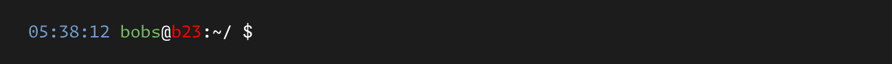
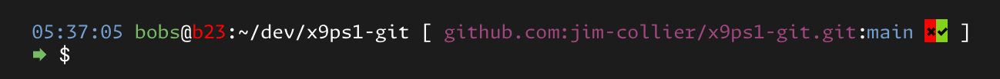

<!-- markdownlint-disable MD007 -- Unordered list indentation -->
<!-- markdownlint-disable MD010 -- No hard tabs -->
<!-- markdownlint-disable MD033 -- No inline html -->
<!-- markdownlint-disable MD055 -- Table pipe style [Expected: leading_and_trailing; Actual: leading_only; Missing trailing pipe] -->
<!-- markdownlint-disable MD041 -- First line in a file should be a top-level heading -->

<!--

-->

<!-- omit in TOC -->
# x9ps1-git

Inspired by - but improves upon - the [tide](https://github.com/IlanCosman/tide) prompt for [fish](https://fishshell.com/) shell.

But for good 'ol regular bash terminals...

- Which is a bonus if you prefer Bash over Fish as a syntax and language.
- Fish's suggestion/auto-completion functionality is admittedly really cool - though the [ble](https://github.com/akinomyoga/ble.sh) project for Bash is arguably nearly as good if not better (taste-dependent).

<!-- omit in TOC -->
## Table of contents

- [Overview](#overview)
- [Feature comparison](#feature-comparison)
- [Screenshots](#screenshots)
- [Other notes](#other-notes)
- [Installation](#installation)

## Overview

The `tide` prompt for `fish` shell is fantastic for working with `git` on the command-line. The prompt tells you what branch your on, and if there are uncommitted changes.

`x9ps1-git` takes `tide`'s idea a bit further - but for `bash`.

## Feature comparison

| Feature                                          | Fish+tide? | x9ps1-git? |
|:---                                              | :---: | :---: |
| Doesn't show git info if not in a repo directory | ✔     | ✔     |
| Shows active repo                                |       | ✔     |
| Shows active branch                              | ✔     | ✔     |
| Shows if merge needed                            | ✔     | ✔     |
| Shows if push needed                             |       | ✔     |
| Shows time of last prompt/status update          |       | ✔     |
| Compresses path display (a pro and a con)        | ✔     |       |
| Has a cool, memorable name                       | ✔     |       |
| Easy to customize prompt¹                        |       | ✔     |

**Footnotes**
¹ *Script includes defined color macros and defined prompt primitives.*

## Screenshots

- Not in github repo directory

	

- In github repo directory

	

## Other notes

- If the terminal is not currently in a git repository folder, the prompt looks similar to most stock prompts. But if it is in a git folder, it expands to two lines in order to include all of the information.

- The program is a fairly small bash script can be easily edited - to add, remove, and/or reorganize the prompt.

- Colors can be assigned to individual elements.

- The hostname element is already nested in the analogue to a switch or case block, so that the hostname can be colored differently depending on the name. (In case this script is synced across multiple hosts.)

- Want multiple configurations? Make multiple copies of the script, and edit each one.

	- *Note: This concept could be expanded - probably without too much effort - to make `x9ps1-git` an immutable base script, that other much simpler "flavor" scripts source.*

## Installation

If installing to a user folder rather than system-wide, don't prepend `sudo` to commands.

~~~bash
## Download to any directory in $PATH (/usr/local/sbin in this example)
cd /usr/local/sbin
sudo wget https://raw.githubusercontent.com/jim-collier/x9ps1-git/main/bin/x9ps1-git
sudo chmod +x x9ps1-git

## Apply to current terminal prompt
PROMPT_COMMAND='PS1=`x9ps1-git`'

## Add the command to your personal .bashrc so that all terminals get the prompt
echo -e "\nPROMPT_COMMAND='PS1=`x9ps1-git`'\n" | tee -a ~/.bashrc
~~~
